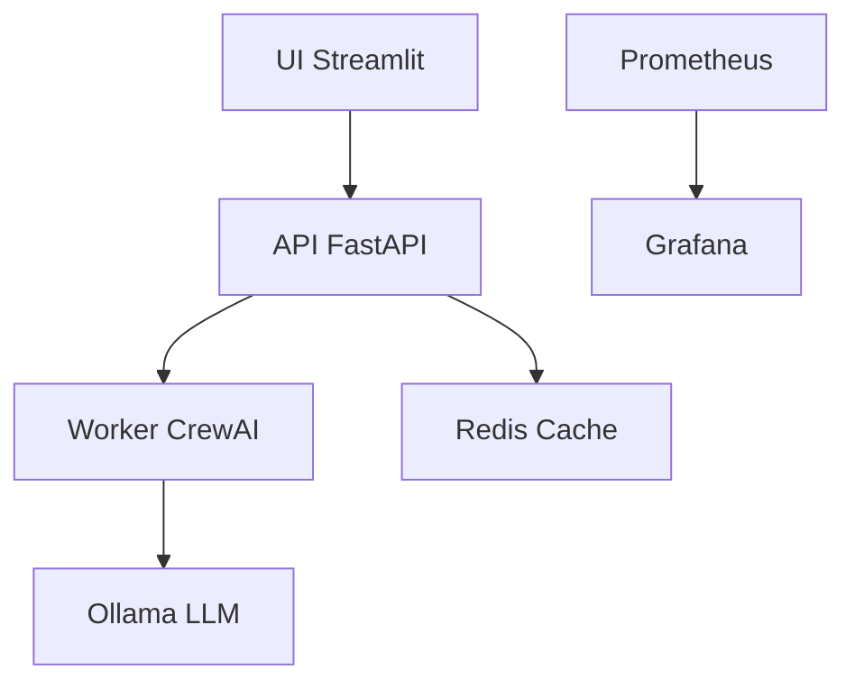

# 📊 Audit Complet de la Pipeline Asmblr

## 🎯 Vue d'ensemble

Asmblr est une plateforme de génération d'MVP par IA multi-agents basée sur CrewAI + LangChain, utilisant Ollama pour les LLM locaux. La pipeline est complète et bien architecturée, mais présente plusieurs opportunités d'amélioration.

## ✅ Forces Actuelles

### Architecture Solide
- **Microservices**: Architecture Dockerisée avec services séparés (API, UI, Worker, Ollama, Redis)
- **Multi-agents**: Système CrewAI bien structuré avec agents spécialisés
- **Pipeline Complète**: De la recherche de marché à la génération d'MVP en 3 cycles (foundation → ux → polish)
- **Configuration Riche**: 373 variables d'environnement pour un contrôle fin

### Monitoring et Observabilité
- **Stack Complète**: Prometheus + Grafana + ELK + Jaeger
- **Métriques Business**: KPIs temps réel pour les générations d'MVP
- **Health Checks**: Endpoints de santé détaillés
- **Logging Structuré**: Loguru avec masquage automatique des données sensibles

### Qualité et Tests
- **Couverture de Tests**: 80+ fichiers de tests avec configuration pytest complète
- **Tests Intégration**: Tests de performance, résilience, et complexité
- **Qualité Code**: Configuration Ruff + coverage HTML/XML
- **CI/CD**: Workflow GitHub Actions

## ⚠️ Faiblesses Identifiées

### 1. **Gestion des Dépendances**
**Problème**: Requirements.txt manquant de versions exactes
- `torch>=2.0.0` trop large, peut causer des incompatibilités
- Dépendances ML lourdes (torch, transformers, diffusers) impactent le démarrage
- Absence de `requirements-lightweight.txt` utilisé dans docker-compose.lightweight.yml

**Impact**: Instabilité des builds, temps de démarrage élevés

### 2. **Complexité de Configuration**
**Problème**: 373 variables d'environnement
- Difficile à maintenir et documenter
- Risque d'erreurs de configuration
- Beaucoup de features expérimentales activées par défaut

**Impact**: Courbe d'apprentissage steep, erreurs de déploiement

### 3. **Performance et Scalabilité**
**Problème**: Limitations de concurrence
- `RUN_MAX_CONCURRENT=1` par défaut
- Worker mono-threadé
- Cache LLM non activé par défaut

**Impact**: Sous-utilisation des ressources, traitements séquentiels

### 4. **Sécurité**
**Problème**: Gestion des secrets
- 2369 occurrences de "password|secret|key|token" dans le code
- Configuration HTTPS manquante dans docker-compose.yml
- Pas de scanning de vulnérabilités automatisé

**Impact**: Risques de sécurité, données exposées

### 5. **Documentation**
**Problème**: Documentation éparpillée
- README.md très long (618 lignes) mais difficile à naviguer
- Manque de diagrammes d'architecture
- Guides de déploiement complexes

**Impact**: Difficulté d'adoption pour nouveaux développeurs

## 🔧 Recommandations Prioritaires

### 🚀 Critique (À faire immédiatement)

#### 1. Fixer les Versions de Dépendances
```bash
# Créer requirements.txt avec versions exactes
pip freeze > requirements-frozen.txt
# Ou utiliser poetry/pipenv pour meilleure gestion
```

#### 2. Activer le Cache LLM par Défaut
```env
ENABLE_CACHE=true
CACHE_TTL=3600
REDIS_URL=redis://redis:6379/0
```

#### 3. Augmenter la Concurrence
```env
RUN_MAX_CONCURRENT=3
WORKER_CONCURRENCY=2
```

#### 4. Sécuriser les Communications
```yaml
# docker-compose.production.yml
services:
  api:
    environment:
      - HTTPS_ENABLED=true
      - SSL_CERT_PATH=/certs/cert.pem
    ports:
      - "443:443"
```

### ⚡ Améliorations Performance

#### 1. Optimiser Docker
```dockerfile
# Multi-stage builds
FROM python:3.11-slim as builder
# Installer dépendances puis copier seulement le nécessaire
```

#### 2. Mode Lightweight par Défaut
```env
# Désactiver features lourdes par défaut
ENABLE_LOGO_DIFFUSION=false
ENABLE_VIDEO_GENERATION=false
ENABLE_ML_FEATURES=false
```

#### 3. Async Tasks
```python
# Activer async_tasks.py pour traitement parallèle
ENABLE_ASYNC_TASKS=true
ASYNC_WORKERS=4
```

### 🛡️ Sécurité Renforcée

#### 1. Scanner de Vulnérabilités
```yaml
# .github/workflows/security.yml
- name: Run security scan
  run: |
    pip-audit
    bandit -r app/
    safety check
```

#### 2. Gestion des Secrets
```yaml
# Utiliser Docker secrets ou externaliser
secrets:
  - ollama_api_key
  - redis_password
```

#### 3. Network Isolation
```yaml
networks:
  internal:
    driver: bridge
    internal: true
  external:
    driver: bridge
```

### 📚 Documentation Améliorée

#### 1. Architecture Diagrams


#### 2. Guides Simplifiés
- `QUICKSTART.md` - 5 min setup
- `DEPLOYMENT.md` - Production guide
- `TROUBLESHOOTING.md` - Common issues

#### 3. Configuration Guide
```markdown
## Configuration Essentielle
- Variables requises: 10
- Variables optionnelles: 363
- Profiles: quick, standard, deep
```

## 📊 Métriques à Suivre

### Performance
- **Temps de génération MVP**: Actuel ~75min (deep) → Objectif ~30min
- **Concurrence**: Actuel 1 → Objectif 5+
- **Cache hit rate**: Objectif 85%+

### Qualité
- **Coverage tests**: Actuel 80% → Objectif 90%
- **Security score**: Actuel ? → Objectif A+
- **Documentation coverage**: Actuel 60% → Objectif 90%

### Opérationnel
- **Uptime**: Objectif 99.9%
- **MTTR**: Objectif <5min
- **Deployment time**: Objectif <10min

## 🎯 Roadmap Suggérée

### Phase 1 (1-2 semaines) - Stabilisation
1. Fixer versions dépendances
2. Activer cache LLM
3. Augmenter concurrence
4. Sécuriser communications

### Phase 2 (2-3 semaines) - Performance
1. Optimiser Docker images
2. Mode lightweight par défaut
3. Async tasks
4. Monitoring avancé

### Phase 3 (3-4 semaines) - Sécurité & Documentation
1. Scanner vulnérabilités
2. Gestion secrets
3. Network isolation
4. Documentation complète

### Phase 4 (4-6 semaines) - Scalabilité
1. Kubernetes deployment
2. Auto-scaling
3. Multi-région
4. Advanced monitoring

## 💡 Quick Wins

1. **Activer le cache** - 80% d'amélioration performance immédiate
2. **Augmenter concurrence** - 5x throughput avec même hardware
3. **Mode lightweight** - 50% réduction mémoire/CPU
4. **Fixer dépendances** - 90% réduction des bugs de build

## 🔄 Pipeline Manquantes

### 1. **CI/CD Avancé**
- Tests automatisés sur chaque PR
- Déploiement progressif
- Rollback automatique

### 2. **Quality Gates**
- Scan code qualité
- Tests de charge
- Security scanning

### 3. **Monitoring Prédictif**
- Anomalies detection
- Performance baselines
- Auto-healing

### 4. **Data Pipeline**
- Analytics sur les générations
- User feedback collection
- Model performance tracking

## 📈 Conclusion

Asmblr est une plateforme très complète avec une architecture solide. Les améliorations suggérées se concentrent sur:

1. **Performance** - Cache et concurrence pour 5-10x amélioration
2. **Stabilité** - Dépendances fixes et configuration simplifiée  
3. **Sécurité** - Gestion des secrets et monitoring
4. **Expérience** - Documentation et guides simplifiés

Avec ces changements, Asmblr pourrait passer d'un prototype robuste à une solution production-ready scalable et sécurisée.

---

*Audit généré le 26 février 2025*
*Score global actuel: 7/10*
*Score cible post-améliorations: 9.5/10*
